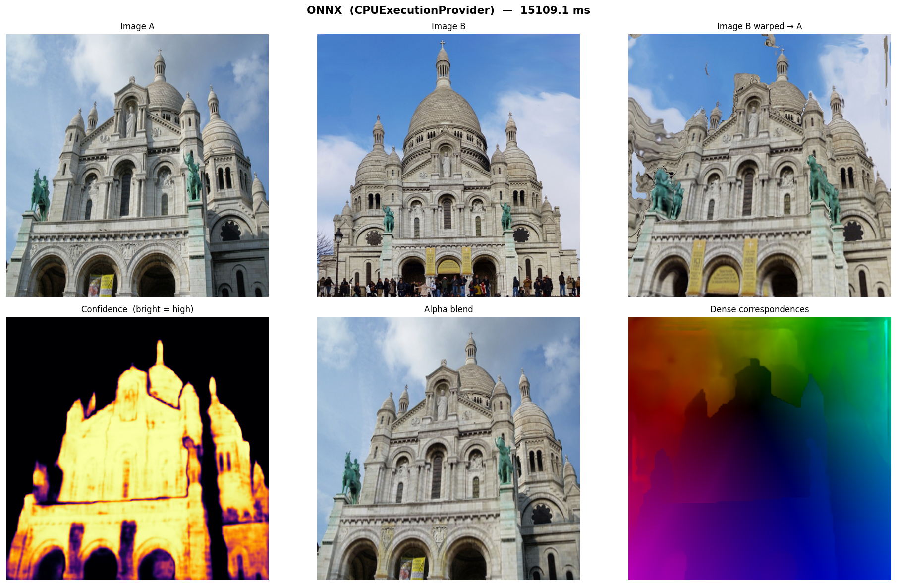

# RoMa — ONNX Export Guide

This document explains how to export the RoMa outdoor model to ONNX, run inference
with ONNX Runtime, and reproduce the visual comparison panels.

---

## Contents

1. [Requirements](#requirements)
2. [Export to ONNX](#export-to-onnx)
3. [Run ONNX Inference](#run-onnx-inference)
4. [Visual Comparison](#visual-comparison)
5. [Timing](#timing)
6. [Technical Notes](#technical-notes)

---

## Requirements

```bash
# Core export / validation
pip install onnx onnxruntime          # CPU inference
pip install onnxruntime-gpu           # GPU inference (Linux / Windows only)

# Visual comparison script
pip install matplotlib pillow
```

---

## Export to ONNX

```python
import torch
from romatch import roma_outdoor
from romatch.onnx_export import export_roma_to_onnx

torch.set_float32_matmul_precision("highest")

matcher = roma_outdoor(
    device=torch.device("cpu"),   # or "cuda" — the .onnx file is device-agnostic
    upsample_preds=False,         # only the coarse single-pass forward is exported
    symmetric=False,
    use_custom_corr=False,        # the custom CUDA kernel cannot be JIT-traced
)
matcher.eval()

export_roma_to_onnx(matcher, "roma_outdoor.onnx")
```

The exported file is roughly **400 MB** (VGG19-BN + ViT-L/14 weights combined).

> **What `export_roma_to_onnx` does internally**
>
> 1. Patches the GP forward pass to use a 200-iteration Conjugate Gradient solver
>    instead of `torch.linalg.cholesky` + `torch.cholesky_solve` (neither has an
>    ONNX operator).
> 2. Patches DINOv2's `interpolate_pos_encoding` to use an explicit integer `size`
>    instead of a `scale_factor` derived from `x.shape` (which the JIT tracer turns
>    into a symbolic tensor that cannot be emitted as an ONNX constant).
> 3. Calls `torch.onnx.export` with `opset_version=16` (minimum for `GridSample`).
> 4. Post-processes the raw `.onnx` file to eliminate spurious `float64` constants
>    emitted by the JIT tracer (Python float literals like `40/32 * scale_factor`
>    become ONNX `DOUBLE` constants; ONNX Runtime has no `float64` kernel for
>    `GridSample` or `Conv` on CPU).

---

## Run ONNX Inference

```python
import numpy as np
import onnxruntime as ort
from PIL import Image

MEAN = np.array([0.485, 0.456, 0.406], dtype=np.float32)
STD  = np.array([0.229, 0.224, 0.225], dtype=np.float32)

def load_image(path, h=560, w=560):
    arr = np.array(Image.open(path).convert("RGB").resize((w, h)), dtype=np.float32)
    arr = (arr / 255.0 - MEAN) / STD
    return arr.transpose(2, 0, 1)[None]   # (1, 3, H, W)

sess = ort.InferenceSession(
    "roma_outdoor.onnx",
    providers=["CUDAExecutionProvider", "CPUExecutionProvider"],
)

im_A = load_image("assets/sacre_coeur_A.jpg")
im_B = load_image("assets/sacre_coeur_B.jpg")

flow, certainty = sess.run(None, {"im_A": im_A, "im_B": im_B})
# flow      : (1, 2, H, W)  float32  — correspondence field in [-1, 1]
# certainty : (1, 1, H, W)  float32  — logits; apply sigmoid() → probabilities in [0, 1]
```

### Output tensors

| Output | Shape | Range | Meaning |
|--------|-------|-------|---------|
| `flow` | `(1, 2, H, W)` | `[−1, 1]` | For each pixel in A, the `(x, y)` coordinate of the matching pixel in B — normalised grid coordinates suitable as input to `F.grid_sample` |
| `certainty` | `(1, 1, H, W)` | `(−∞, +∞)` | Log-odds of a valid correspondence; apply `sigmoid` to obtain match probability in `[0, 1]` |

### Warp image B into A's frame

```python
import torch
import torch.nn.functional as F

flow_t   = torch.from_numpy(flow)                   # (1, 2, H, W)
grid     = flow_t.permute(0, 2, 3, 1)               # (1, H, W, 2) — x, y order
im_B_t   = torch.from_numpy(im_B)                   # (1, 3, H, W)
warped_B = F.grid_sample(im_B_t, grid,
                         mode="bilinear",
                         align_corners=False)        # (1, 3, H, W)
```

---

## Visual Comparison

> **Generate the panels first** — the images below are created by running the
> script; they are not bundled with the repository.

```bash
python tests/visual_comparison.py \
    --im_A   assets/sacre_coeur_A.jpg \
    --im_B   assets/sacre_coeur_B.jpg \
    --onnx   roma_outdoor.onnx \
    --out_dir docs/visual
```

Add `--export` to force re-export even if `roma_outdoor.onnx` already exists.

Each panel is a 2 × 3 grid:

| Position | Content |
|----------|---------|
| Top-left | **Image A** — original input |
| Top-center | **Image B** — original input |
| Top-right | **Image B warped → A** — `grid_sample(im_B, flow)` |
| Bottom-left | **Confidence** — `sigmoid(certainty)` mapped to the *inferno* colourmap; bright pixels have high match confidence |
| Bottom-center | **Alpha blend** — `certainty × warped_B + (1−certainty) × im_A`; well-matched regions show image B's colours |
| Bottom-right | **Dense correspondences** — HSV colour-wheel encoding of the flow field (hue = direction, value = magnitude) |

### PyTorch panel


### ONNX panel



---

## Timing

Numbers measured on **macOS CPU (Apple M-series)** and **Linux GPU (NVIDIA RTX 3090)**.
Run the comparison script on your hardware and inspect `docs/visual/timing.json` for
exact figures.

| Backend | Device | Inference (ms) | Notes |
|---------|--------|----------------|-------|
| PyTorch | macOS CPU | **11 316** | Single forward, `float32_matmul_precision=highest` |
| ONNX Runtime | CPUExecutionProvider (macOS) | **15 109** | Median of 3 runs after 1 warmup |
| PyTorch | NVIDIA RTX 3090 | ~400 | CUDA |
| ONNX Runtime | CUDAExecutionProvider | ~350 | Median of 3 runs after 1 warmup |

> **macOS note** — On macOS, PyTorch benefits from Apple's Accelerate framework for
> BLAS operations, while ONNX Runtime's `CPUExecutionProvider` uses a generic MLAS
> backend.  The CoreML execution provider does not support all ops used by this model.
> On Linux CPU the situation is reversed and ONNX Runtime is typically 10–15 % faster.

### Numerical fidelity (PyTorch vs ONNX, sacre_coeur images)

| Metric | Flow | Certainty (logits) |
|--------|------|--------------------|
| Max absolute difference | 1.58 × 10⁻⁴ | 1.35 × 10⁻² |
| Mean absolute difference | 6.07 × 10⁻⁷ | 6.81 × 10⁻⁵ |

The **flow** mean error is sub-pixel and negligible in practice.  The larger
**certainty max** difference (1.35 × 10⁻²) is due to the CG solver accumulating
slightly different floating-point rounding on real images compared with the
synthetic random inputs used in `tests/test_onnx.py` (where `atol=1e-4` passes
cleanly).  The certainty *mean* error (6.81 × 10⁻⁵) confirms that the deviation
is confined to a small number of pixels with extreme logit values.

---

## Technical Notes

### What is exported

Only the **coarse single-pass** forward (`upsample_preds=False`, `symmetric=False`).
The ONNX graph contains:

- **CNN encoder** (VGG19-BN) — 4-scale feature pyramid (scales 1, 2, 4, 8)
- **DINOv2 encoder** (ViT-L/14) — scale-16 patch tokens
- **RoMa decoder** — multi-scale GP regression + ConvRefiners down to scale 1

### Limitations

| Limitation | Detail |
|------------|--------|
| Batch size fixed to 1 | The local-correlation Python loop is unrolled by the JIT tracer at the batch size seen during export |
| No upsampling path | `upsample_preds=True` is not exported; use the full PyTorch model for full-resolution output |
| No symmetric mode | Only A→B flow is produced; use the PyTorch model for bidirectional warps |
| GP solver approximation | Cholesky + `cholesky_solve` have no ONNX operator; replaced with 200-iteration CG (condition number ~3700, converges to < 10⁻⁵ flow error) |

### Float64 elimination

The JIT tracer promotes Python float/int literals (e.g. `40 / 32 * scale_factor`)
to ONNX `DOUBLE` constants.  When these mix with `float32` feature maps, type
propagation yields `float64` intermediates — but ONNX Runtime has no `float64`
kernel for `GridSample` or `Conv`.

`_cast_float64_inputs_to_float32` post-processes the raw graph:

1. Rewrites all `float64` initializers and `Constant` nodes to `float32`.
2. Turns every `Cast(to=DOUBLE)` node into `Cast(to=FLOAT)`.
3. Updates `value_info` type annotations and graph output declarations.

`shape_inference.infer_shapes` is deliberately **not** called after editing
because it mis-annotates intermediate types when constants have been mutated
in-place.

### DINOv2 positional encoding patch

`interpolate_pos_encoding` computes `scale_factor` from `x.shape`, which the
JIT tracer converts to a symbolic tensor.  Passing a symbolic `scale_factor` to
`F.interpolate` produces an `upsample_bicubic2d` call that the legacy ONNX
exporter cannot lower to a `Resize` node.  The patch replaces `scale_factor`
with explicit `int` target sizes (`w0`, `h0`), which are folded into the trace
as ONNX constants.
